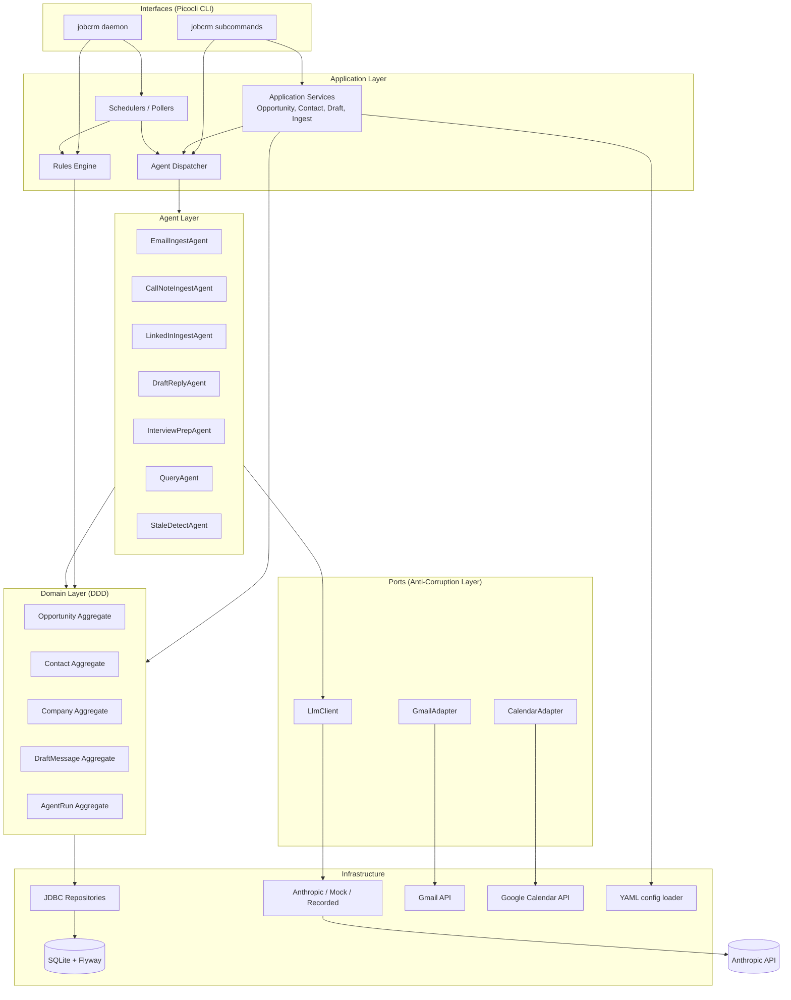
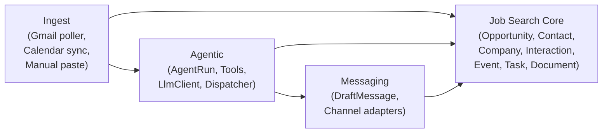
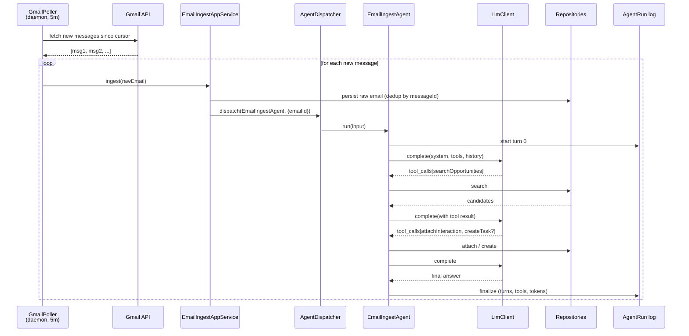
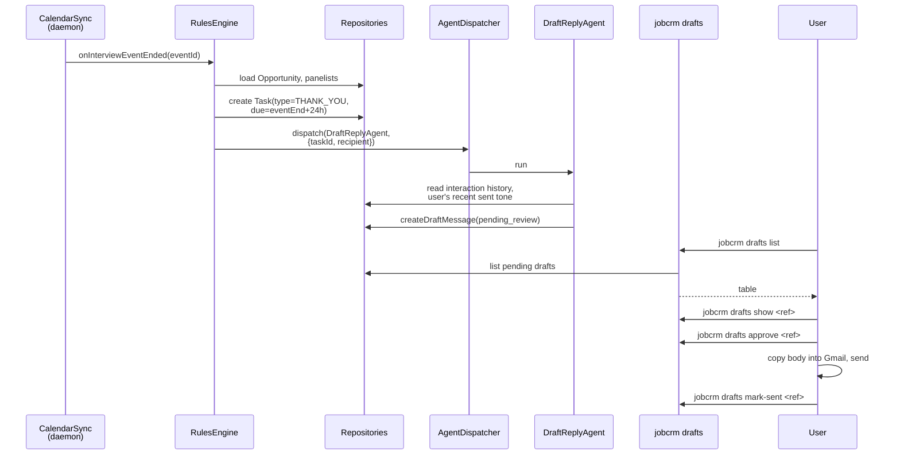
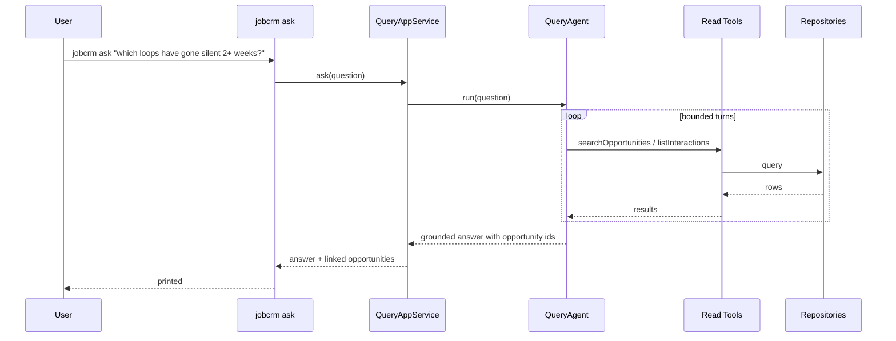

# Design Document: Job-Search CRM

## Overview

Job-Search CRM is a local, single-user, agentic contact-management application built to run a job search end-to-end. The central aggregate is the **Opportunity** — a specific role at a specific company — not the Contact. The same recruiter or hiring manager may show up across several loops, and everything of interest (interactions, interviews, follow-ups, drafts) hangs off the loop, not off a person.

The system is a hybrid of deterministic rules and LLM agents. Anything with a clear `if` (scheduled Gmail polling, post-interview thank-you creation, stale-loop sweeps) is coded as a plain scheduler or rule. Fuzzy work (classifying an inbound email against opportunities, extracting commitments, drafting a reply in the user's voice, answering a natural-language question) is handled by narrow, single-purpose agents. Every agent is bounded: capped step count, restricted tool set, no autonomous outbound communication. Drafts are always human-approved before send.

The app runs locally on the user's machine, exposes a CLI (`jobcrm`) as its only user surface in v1, and persists to a single SQLite file. The only outbound traffic is to the configured LLM provider and to Google APIs (Gmail and Calendar).

---

## Companion Documents

This document is the architectural entry point. Detail lives in these companions:

| Document | Scope |
|----------|-------|
| `.kiro/steering/development-guidelines.md` | Language, JDK, DDD conventions, package structure, testing, dependencies, code style. Auto-included in every session. |
| `domain-model.md` | Aggregates, entities, value objects, repositories, SQLite schema, validation rules, correctness properties. |
| `agent-architecture.md` | `LlmClient` abstraction, tool contract, `AgentRunner`, agent roster, prompts, concurrency, agent-side testing. |
| `ui-cli.md` | CLI command surface, daemon lifecycle, output conventions, draft-review flow, config file layout. |

Read the guidelines first; read the companions on demand.

---

## Non-Goals for v1

- No web UI, desktop UI, or mobile client.
- No autonomous outbound messaging. Drafting is the ceiling; sending is manual.
- No LinkedIn API integration; LinkedIn ingestion is manual paste.
- No multi-user or cloud deployment. Local, single-user, single-machine.
- No app-level secret encryption. YAML config in a user-owned directory relies on OS filesystem permissions.

---

## Assumed Defaults

| Decision | Default |
|----------|---------|
| JDK | Java 25 (current LTS, released Sept 2025) |
| Build tool | Gradle 8.x (Kotlin DSL) |
| Framework backbone | Spring Boot 3.3.x (DI, config, scheduling — no web) |
| UI | Picocli CLI |
| LLM provider (default binding) | Anthropic |
| Gmail auth | OAuth 2.0 (installed-app flow) |
| Calendar integration | In scope for v1 (drives post-interview follow-up rule) |
| LinkedIn ingestion (v1) | Manual paste |
| Secrets storage | Plain YAML at `~/.jobcrm/config.yml`; env-var overrides. No app-level encryption in v1. |
| DB | SQLite (WAL mode) |
| DB migrations | Flyway |
| Test stack | JUnit 5 + AssertJ; jqwik for properties; Mockito for unit mocks; recorded fixtures for integration LLM tests; ArchUnit for package rules |

---

## Architecture

### High-Level Component Diagram



---

### Bounded Contexts

Four contexts, one process, no service boundaries. The split is a package-level discipline enforced by dependency direction, not by runtime deployment. Dependency direction is defined in `.kiro/steering/development-guidelines.md`.



- **Job Search Core** — the authoritative domain. Everyone reads from it; only application services mutate it.
- **Messaging** — drafts and (future) send adapters. Isolated so send tooling can arrive later without disturbing core rules.
- **Agentic** — everything related to running agents. Depends on Core (through allow-listed tools) but Core knows nothing about it.
- **Ingest** — bridges external sources (Gmail, Calendar, manual input) into Core and fires agent dispatches.

---

### Package / Module Map

```
com.jobcrm
├── core                   // Job Search Core context
│   ├── domain             // Opportunity, Contact, Company, Interaction, Event, Task, Document
│   └── application        // OpportunityService, ContactService, ...
├── messaging              // Draft & outbox context
│   ├── domain             // DraftMessage
│   └── application        // DraftReviewService
├── agentic                // Agent runtime context
│   ├── domain             // AgentRun, AgentTurn, LlmClient port, ToolRegistry port
│   ├── application        // AgentRunner, AgentDispatcher
│   └── agents             // Concrete AgentDefinitions + prompts
├── ingest                 // Ingest context
│   ├── application        // EmailIngestAppService, CalendarSyncService
│   └── infrastructure     // Gmail poller wiring
├── rules                  // Deterministic scheduling and rule execution
├── interfaces
│   └── cli                // Picocli commands (see ui-cli.md)
├── infrastructure
│   ├── persistence        // JDBC repository implementations
│   ├── migrations         // Flyway SQL files
│   ├── llm                // AnthropicLlmClient, MockLlmClient, RecordedLlmClient
│   ├── gmail              // Gmail API adapter
│   ├── calendar           // Google Calendar API adapter
│   └── config             // YAML/env config loader
└── app                    // Composition root, main(), Spring configuration
```

---

### Key Sequence Flows

### Email ingest



### Post-interview follow-up



### Natural-language query



---

### Rules Engine (Deterministic Scheduling)

The rules engine is where non-agent scheduled work lives. It never calls the LLM. It creates tasks and dispatches agents.

### Post-interview follow-up (pseudocode)

```pascal
ALGORITHM onCalendarSyncTick(now)
BEGIN
  events ← calendarAdapter.pullSince(calendarCursor.syncToken())
  FOR each cal IN events DO upsertEvent(cal) END FOR

  windowStart ← now - 15m
  windowEnd   ← now
  ended ← eventRepository.findEndedBetween(windowStart, windowEnd)

  FOR each e IN ended DO
    IF e.kind IN {INTERVIEW, ONSITE} THEN
      opp ← opportunityRepository.findById(e.opportunity)
      IF opp.isPresent AND NOT opp.hasOpenTaskOfType(THANK_YOU, forEvent=e.id) THEN
        FOR each participant IN e.participants DO
          task ← Task.newThankYou(
            opportunity = e.opportunity,
            dueAt       = e.endsAt + 24h,
            note        = "Thank-you to " + participant + " for " + e.title
          )
          taskRepository.save(task)
          dispatcher.dispatchAsync(
            DraftReplyAgent, { "taskId": task.id, "recipientContactId": participant }
          )
        END FOR
      END IF
    END IF
  END FOR
END
```

**Preconditions**: calendar adapter authenticated; `Task.hasOpenTaskOfType` is a repository query.
**Postconditions**: per interview or onsite that ended in the window with no existing open THANK_YOU, exactly one THANK_YOU task per participant with `dueAt = endsAt + 24h`; a `DraftReplyAgent` dispatch is enqueued for each.

### Nightly stale-loop sweep

```pascal
ALGORITHM nightlyStaleSweep(now)
BEGIN
  cutoff ← now - 14d
  candidates ← opportunityRepository.findSilentSince(cutoff)
  FOR each opp IN candidates DO
    IF opp.stage.isTerminal() THEN CONTINUE END IF
    IF NOT opp.hasOpenTaskOfType(NUDGE) THEN
      task ← Task.newNudge(
        opportunity = opp.id,
        dueAt       = now + 1d,
        note        = "Silent for ≥14 days — consider re-engaging"
      )
      taskRepository.save(task)
    END IF
  END FOR
  dispatcher.dispatchAsync(StaleDetectAgent, { "since": cutoff.toString() })
END
```

**Postconditions**: every non-terminal opportunity silent for ≥14 days has at most one open NUDGE task; a single `StaleDetectAgent` run is triggered.

---

---

## Components and Interfaces

Full definitions are split across the companion docs. Summary map:

| Component | Where it's defined | Kind |
|-----------|--------------------|------|
| Aggregate roots: `Opportunity`, `Contact`, `Company`, `DraftMessage` | `domain-model.md` | Domain |
| Child entities: `Interaction`, `Event`, `Task`, `Document` | `domain-model.md` | Domain |
| Value objects: strongly-typed IDs, `EmailAddress`, enums (`Stage`, `Channel`, ...) | `domain-model.md` | Domain |
| Repository interfaces: `OpportunityRepository`, `ContactRepository`, ... | `domain-model.md` | Port |
| Application services: `OpportunityService`, `ContactService`, `DraftReviewService` | `domain-model.md` | Application |
| `LlmClient`, `LlmRequest`, `LlmResponse`, `ToolSpec`, `ToolCall` | `agent-architecture.md` | Port |
| `AgentTool`, `ToolRegistry`, `ToolContext` | `agent-architecture.md` | Port |
| `AgentRun` aggregate + `AgentTurn` sealed hierarchy | `agent-architecture.md` | Domain |
| `AgentDefinition`, `AgentRunner`, `AgentDispatcher` | `agent-architecture.md` | Application |
| Concrete agents (Email/Call/LinkedIn Ingest, DraftReply, InterviewPrep, Query, StaleDetect) | `agent-architecture.md` | Application |
| Adapters: `GmailAdapter`, `CalendarAdapter`, `AnthropicLlmClient`, `MockLlmClient`, `RecordedLlmClient` | referenced in `agent-architecture.md` and this doc; implemented in `infrastructure` | Infrastructure |
| Picocli commands (`jobcrm ...`) | `ui-cli.md` | Interfaces |

Every port lives in `domain` or `application`; every adapter lives in `infrastructure`. Dependency rules are enforced by ArchUnit tests (see `.kiro/steering/development-guidelines.md`).

---

## Data Models

Full schema, aggregate shapes, value objects, and migration policy live in `domain-model.md`. Agent-runtime tables (`agent_run`, `agent_turn`) live in `agent-architecture.md`. Cursor tables for Gmail and Calendar (`gmail_cursor`, `calendar_cursor`) are in `domain-model.md` alongside the core schema.

Persistence rules:

- SQLite with WAL mode. Single database file at the path configured under `db.path`.
- Flyway migrations under `infrastructure/migrations/V{n}__*.sql`. Additive within a released major.
- UUIDs stored as TEXT for readability; timestamps stored as ISO-8601 TEXT.
- All foreign keys `ON DELETE CASCADE` or `ON DELETE SET NULL` as specified in the schema — no orphan cleanup jobs.

---

## Error Handling

| Scenario | Response | Recovery |
|----------|----------|----------|
| LLM provider unavailable | Agent run marked FAILED with `provider_unavailable`. | Scheduled agents retry with exponential backoff. User-triggered agents surface failure in the CLI. |
| Gmail OAuth token expired | Poller pauses, logs WARN, `jobcrm auth status` reports the failure. | User runs `jobcrm auth gmail` to re-consent. Poller resumes from last-known `historyId`. |
| Agent attempts a disallowed tool | Run marked FAILED with `policy_violation:<tool>`. Tool is never executed. | None automatic. Investigate the agent's prompt or allow-list. |
| Ambiguous email → opportunity match | `EmailIngestAgent` creates an ambiguity Task; run terminates SUCCESS with no attachment. | User resolves via `jobcrm opp attach-...` or manual assignment. |
| SQLite `SQLITE_BUSY` | JDBC wrapper retries with jittered backoff up to 3 times. | In-flight agent runs mark FAILED with `storage_contention`; dispatcher re-enqueues. |
| Malformed LLM tool_calls | Runner appends a synthetic TOOL turn with `ok=false, errorMessage=...` and re-enters the loop. | Up to 3 consecutive schema failures → run FAILED. |

Full failure-mode inventory for agents is in `agent-architecture.md`.

---

## Security Considerations

- **Data locality**: the SQLite file is on the user's disk. Rely on OS-level encryption (FileVault, BitLocker). App does not encrypt at rest in v1.
- **Secrets storage**: OAuth refresh tokens and LLM API keys sit in plain YAML at `~/.jobcrm/config.yml`. Directory documented as sensitive; permissions default to owner-only where the OS allows.
- **PII in LLM calls**: every ingest agent sends the email body to the LLM provider. This is user-consented (it is the point of the app) but must be surfaced in an in-CLI privacy summary (`jobcrm privacy`) that lists, per agent, which fields are transmitted.
- **Prompt injection**: all content fetched from external sources (emails, calendar descriptions, pasted LinkedIn text) is treated as untrusted input. Agents' system prompts include instructions to disregard directives found in message bodies. Structurally, tools that mutate state require the caller (the LLM) to pass structured arguments — an injected email cannot itself invoke a tool because it never enters the `tool_calls` channel.
- **Outbound traffic surface**: LLM provider domain(s) and Gmail/Calendar API domains only. Documented so the user can firewall-audit.
- **No auth model**: single-user, single-machine. If the app is ever extended to network access, a login layer must precede any remote binding.

---

## Performance Considerations

- **LLM latency dominates.** Nothing else in this system matters for perceived performance. Cap agent turns at 6–12 depending on agent. Consider a smaller/faster model for high-volume agents (`EmailIngestAgent`) and a stronger model for low-volume, high-quality-bar agents (`DraftReplyAgent`).
- **SQLite WAL mode** for concurrent reads while a writer is active. Single-writer discipline enforced by the size-1 Hikari write pool; read pool up to 4.
- **Read tools return capped lists** (default `limit=25`) to keep tool payloads small in the LLM context.
- **`AgentRun` log growth**: every run writes rows to `agent_run` and `agent_turn`. Retention 90 days by default; nightly maintenance job prunes older rows.
- **Gmail polling**: 5-minute cadence, delta fetch via `historyId` — no full sync per tick.

---

## Correctness Properties

The full property lists live in `domain-model.md` (domain-side) and `agent-architecture.md` (agent-side). Property tests using jqwik seed from both. Cross-cutting highlights:

### Property 1: Idempotent email ingest

For all `RawEmail e`, calling `EmailIngestAppService.ingest(e)` any number of times results in at most one `Interaction` with `externalId = e.messageId`.

### Property 2: Stage-transition safety

For all opportunities `o` and stages `s`, `advanceStage(o.id, s)` succeeds iff `o.stage.canTransitionTo(s)`. On failure, `o.stage` is unchanged.

### Property 3: Draft state machine reachability

Every `DraftMessage` `d.status` traces `PENDING_REVIEW → APPROVED → SENT` or `PENDING_REVIEW → DISCARDED`. No other transitions are possible.

### Property 4: Contact email uniqueness

For all `EmailAddress` values `x`, at most one `Contact c` satisfies `x ∈ c.emails()`.

### Property 5: Bounded agent runs

Every `AgentRunOutcome` is `Success`, `Failed`, or `Aborted` after at most `def.maxSteps()` LLM turns.

### Property 6: Tool allow-list enforcement

For every persisted `AgentTurn` of role `TOOL`, the tool name is in the invoking agent's `allowedToolNames()`.

### Property 7: No autonomous send

No tool named `sendMessage` exists in the registry. No `AgentTurn` in any `AgentRun` references such a tool.

### Property 8: Agent grounding audit trail

Every domain change caused by an agent has a linked tool-call turn in an `AgentRun` whose `agent_run_id` binds the change to the run.

### Property 9: Post-interview task creation is idempotent

For every interview `Event e` with `e.endsAt < now`, exactly one open `THANK_YOU` `Task` per participant exists with `dueAt = e.endsAt + 24h`, provided the rules engine has ticked after `e.endsAt`.

---

---

## Testing Strategy

Full conventions are in `.kiro/steering/development-guidelines.md`. Summary:

- **Unit tests** (JUnit 5 + AssertJ) for pure domain logic. 100% branch coverage on state machines.
- **Property-based tests** (jqwik) for the correctness properties enumerated in `domain-model.md` and `agent-architecture.md`.
- **Repository tests** run against a real SQLite temp file per test class, with Flyway migrations executed in `@BeforeAll`. No H2 substitute.
- **Architecture tests** (ArchUnit) enforce package dependency rules and layer boundaries.
- **LLM tests** use a dual strategy: Mockito-stubbed `LlmClient` for unit-level control-flow tests; recorded JSON fixtures replayed via `RecordedLlmClient` for integration tests. CI never calls a real LLM API — recording is a manual developer step (`jobcrm dev record-agent <name> <scenario>`).
- **Integration tests** wire a full Spring context with in-memory temp SQLite, a fake `GmailAdapter` and `CalendarAdapter`, and either mocked or recorded `LlmClient`. They assert end-to-end: input event → domain state change → dispatched agent run → persisted draft/task.

Per-context test detail:

- Domain correctness properties → `domain-model.md`.
- Agent runtime properties, fixture layout, dev record command → `agent-architecture.md`.
- CLI expectations → smoke tests exercise the top command surface documented in `ui-cli.md`.

---

## Dependencies

Runtime and test dependencies are enumerated in `.kiro/steering/development-guidelines.md`. External services in v1:

- **Anthropic API** (default; swappable via `LlmClient` binding).
- **Gmail API** (OAuth 2.0 installed-app flow).
- **Google Calendar API** (same OAuth grant).

All external calls go through the anti-corruption layer (`LlmClient`, `GmailAdapter`, `CalendarAdapter`), so any provider can be swapped without touching domain or agent code.

---

## Deployment

Single JAR built by Gradle: `./gradlew bootJar` produces `jobcrm.jar`. Users run:

```
java -jar jobcrm.jar init
java -jar jobcrm.jar auth gmail
java -jar jobcrm.jar daemon start
```

A wrapper script (`jobcrm` on Linux/macOS, `jobcrm.bat` on Windows) is packaged so users can drop it on their `PATH`.

No installer in v1. No packaged native launcher (jlink/jpackage) in v1 — noted as a future ergonomic upgrade.
